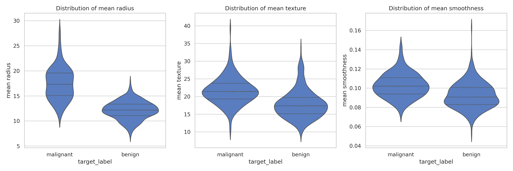
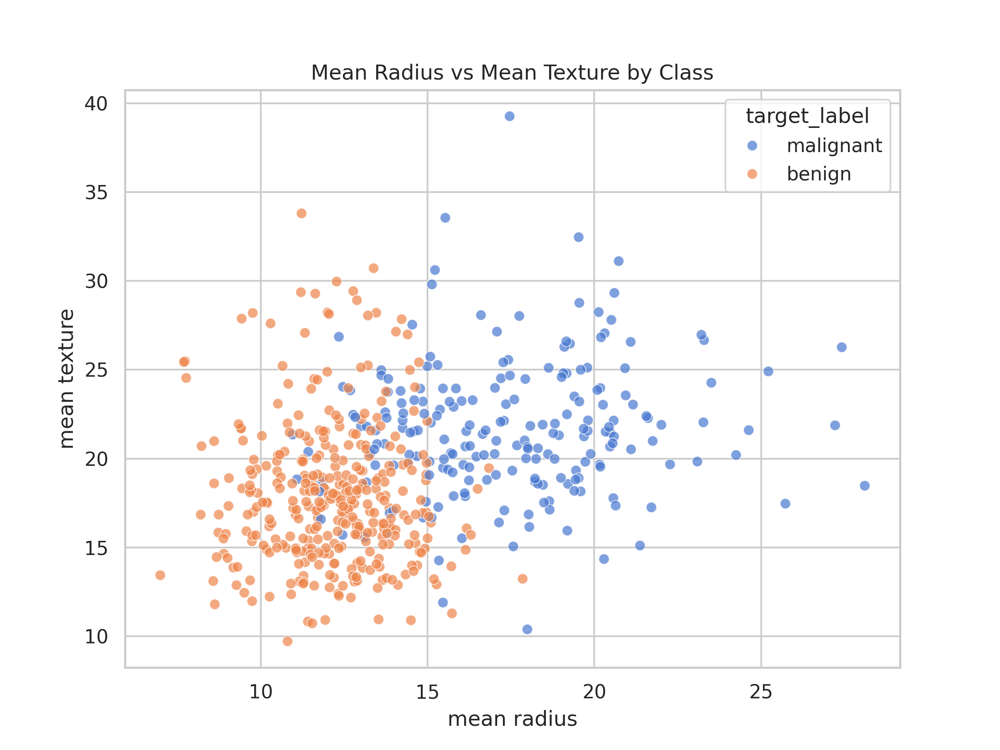
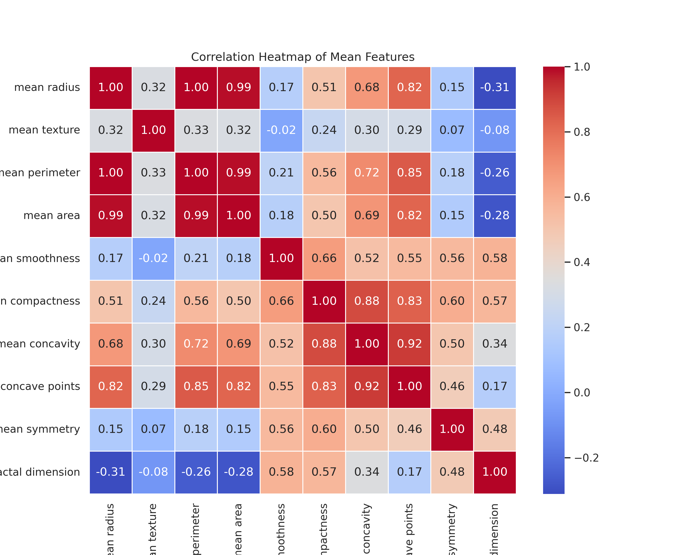
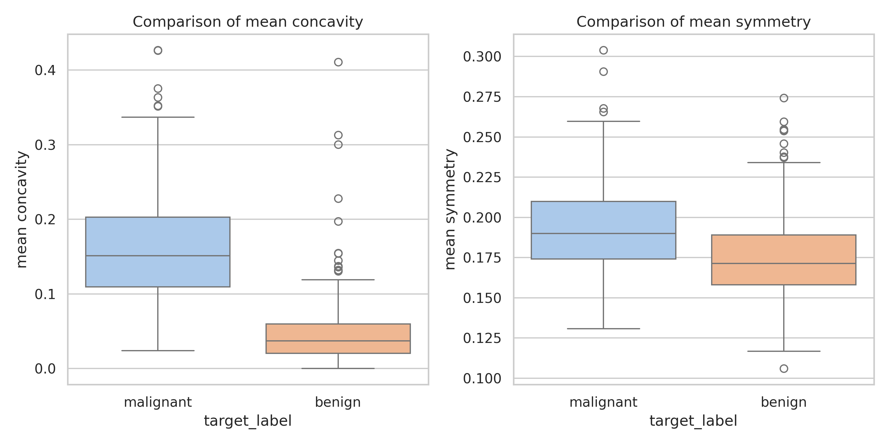
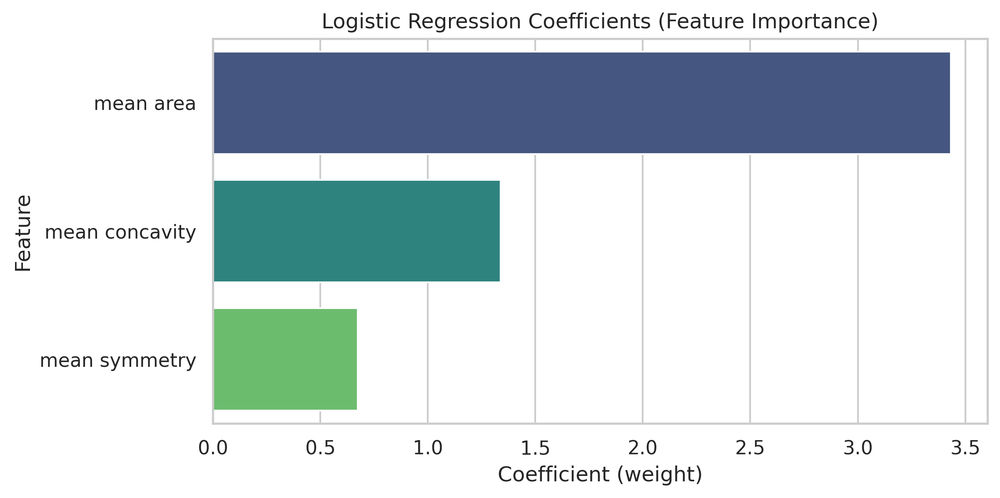
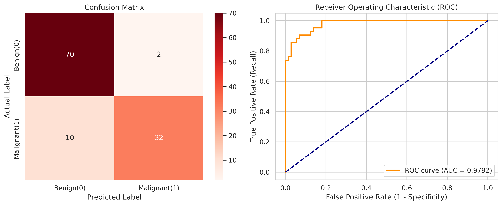

# Breast Cancer Exploratory Data Analysis (EDA)

이 프로젝트는 Scikit-learn에서 제공하는 유방암(Breast Cancer Wisconsin) 데이터셋을 활용하여, 종양의 형태학적 특징(Morphological features)이 악성(Malignant) 및 양성(Benign) 판별에 미치는 영향을 생물학적 관점에서 탐색한 EDA 포트폴리오입니다.

## 1. Dataset Overview
*   **Source:** Scikit-learn 내장 데이터셋 (`load_breast_cancer`)
*   **Instances (총 샘플 수):** 569개 종양 데이터
*   **Features (특징 변수):** 30개의 수치형 변수 (종양의 반경, 질감, 면적 등 세포핵의 디지털 이미지에서 추출된 형태학적 계산값)
*   **Target (분류 클래스):** 악성(Malignant, 212개) vs 양성(Benign, 357개)

---
## 2. Data Preprocessing & Quality Control (QC)

데이터의 무결성을 검증하고, 본격적인 탐색 전 클래스 분포를 확인했습니다.

*   **Missing Values (결측치):** 0개. 추가적인 결측치 대체(Imputation) 파이프라인 불필요.
*   **Class Distribution (클래스 불균형):** 
    *   Benign (양성): 357건 (62.7%)
    *   Malignant (악성): 212건 (37.3%)
    *   **Insight:** 극단적 불균형은 아니나, 의료 도메인의 특성상 모델링 시 False Negative를 최소화하기 위해 Recall(재현율) 지표에 가중치를 두어야 함을 시사함.

### 🩺 생물학적 기초 통계 비교 (Malignant vs Benign)

| Target Label | Mean Radius (평균 반경) | Mean Area (평균 면적) | Biological Insight |
| :--- | :---: | :---: | :--- |
| **Benign (양성)** | 12.15 | 462.79 | 정상적인 세포 분열 주기를 유지하며 뚜렷한 경계를 가짐 |
| **Malignant (악성)** | **17.46** | **978.38** | 통제 불능의 **세포 증식(Proliferation)**으로 인해 세포 크기(Area)가 급격히 팽창함 |

---
## 3. Exploratory Data Analysis (EDA) & Visualizations

세포핵의 형태학적 특징이 악성 종양 판별에 미치는 영향을 시각적으로 탐색했습니다.

### 3.1. 형태학적 특징의 분포 (Distribution of Key Features)

*   **분석:** 악성(Malignant) 종양은 양성(Benign)에 비해 `mean radius`와 `mean texture`의 분산이 매우 넓습니다.
*   **생물학적 해석:** 이는 암세포 특유의 **종양 내 이질성(Intratumor Heterogeneity)**과 통제 불능의 비정상적 핵 분열을 시사합니다. 세포핵의 질감(Texture) 편차가 큰 것은 염색질(Chromatin)의 뭉침 현상 등 악성 종양의 병리학적 특징을 반영합니다.

### 3.2. 클래스 분리도 및 다중공선성 (Class Separability & Multicollinearity)

  
  

*   **Scatter Plot:** 크기(`mean radius`)와 질감(`mean texture`) 단 두 개의 변수만으로도 양성과 악성 데이터가 비교적 뚜렷하게 군집화(Clustering)되는 것을 확인했습니다. 이는 선형 분류기(Linear Classifier)로도 준수한 성능을 낼 수 있음을 암시합니다.
*   **Correlation Heatmap:** `radius`, `perimeter`, `area` 간의 상관계수가 0.99 이상으로 나타납니다. 향후 예측 모델링 단계에서는 다중공선성(Multicollinearity)을 방지하고 모델을 경량화하기 위해, 물리적으로 동일한 차원을 설명하는 변수들에 대한 Feature Selection이 필요합니다.

### 3.3. 종양의 형태학적 붕괴와 유의성 (Morphological Irregularity)

*   **생물학적 고찰:** 악성 종양은 주변 조직으로의 침윤(Invasion)과 유전적 불안정성으로 인해 세포핵 경계가 심하게 붕괴됩니다. 데이터 분석 결과, 악성 데이터군에서 **오목함(Concavity)** 수치가 급격히 상승하며, 정상적인 **대칭성(Symmetry)**을 상실하는 것을 Boxplot과 T-test(p-value < 0.05)를 통해 통계적으로 교차 검증했습니다.

---
## 4. Machine Learning Scale-up: Feature Engineering

선형 기반 기계학습 모델의 해석력을 높이고 다중공선성(Multicollinearity)을 철저히 해소하기 위해, **VIF(Variance Inflation Factor)** 기반의 Feature Selection을 수행했습니다.

*   **배경:** `mean radius`, `mean perimeter`, `mean area` 등의 변수는 물리적/기하학적으로 강하게 종속되어 있어 모델 가중치(Coefficient)의 심각한 왜곡을 유발합니다.
*   **해결 전략:** 임계값(Threshold)을 10으로 설정하고, VIF가 가장 높은 변수부터 반복적으로 제거하는 Stepwise 알고리즘을 적용했습니다.
*   **최종 선택된 변수 (Selected Features):**
    *   `mean area`: 종양의 제어 불가능한 세포 증식(Proliferation)을 대변.
    *   `mean concavity`: 주변 조직 침윤에 의한 형태학적 붕괴 대변.
    *   `mean symmetry`: 유전적 불안정성에 의한 비대칭 성장 대변.
*   **결과:** 중복되는 기하학적 특성을 덜어내고, 생물학적 독립성을 가진 3개의 핵심 변수만으로 모델을 성공적으로 경량화했습니다.

---

## 5. Interpretable Baseline Modeling: Logistic Regression

블랙박스 모델을 적용하기 전, 추출된 핵심 변수들이 암 발현에 미치는 생물학적 가중치를 수치화하여 증명하기 위해 로지스틱 회귀(Logistic Regression) 베이스라인 모델을 구축했습니다.

### 5.1. 모델링 전략 및 전처리
*   **Target Alignment:** 의료 예측 모델의 표준 논리에 맞추어 악성(Malignant)을 Positive(1), 양성(Benign)을 Negative(0)로 재매핑하여 리스크를 예측하도록 설계했습니다.
*   **Standard Scaling:** 단위가 서로 다른 변수(`area`와 `concavity` 등)가 회귀 계수에 미치는 왜곡을 방지하기 위해 `StandardScaler`를 적용하여 데이터의 분포를 정규화했습니다.
*   **Data Leakage Prevention:** Train set(80%)에만 스케일러를 Fit하여 검증 데이터의 정보 누수를 철저히 차단했습니다.

### 5.2. Coefficient Analysis (생물학적 가중치 해석)

*   **해석:** 학습된 회귀 모델의 계수(Coefficient)를 추출한 결과, `mean area`가 약 +3.43으로 가장 강력한 악성 판단 가중치를 가짐을 증명했습니다. 이는 형태의 붕괴(`concavity`, `symmetry`)도 중요하지만, **근본적인 세포 증식(Proliferation)에 의한 부피 팽창이 암세포를 특정하는 가장 지배적인 물리적 지표**임을 수학적으로 뒷받침합니다.

---
## 6. Clinical Metrics Evaluation (임상 지표 검증)

단순히 전체 정확도(Accuracy)를 높이는 것을 넘어, 의료 인공지능의 핵심인 **'위음성(False Negative) 최소화'** 관점에서 모델을 평가했습니다.

### 6.1. Confusion Matrix & ROC-AUC

*   **분석 결과:** 
    *   **Accuracy:** 약 89.5%
    *   **ROC-AUC:** 0.979 (모델의 전반적인 암/정상 분류 성능이 매우 우수함)
    *   **Recall (재현율):** 76.2%
*   **임상적 고찰:** 본 베이스라인 모델은 정밀도(Precision, 94.1%)는 매우 높으나, 재현율(Recall) 측면에서 실제 암 환자의 일부를 정상으로 오진(False Negative)하는 한계를 보였습니다. 생명이 직결된 종양학 데이터에서는 불필요한 추가 검사 비용(False Positive)을 감수하더라도, 병을 놓치는 위음성(False Negative)을 극도로 통제해야 합니다.

이러한 선형 베이스라인의 한계(Recall 최적화의 어려움)를 극복하기 위해, 향후 다중 오믹스 데이터를 결합한 딥러닝 앙상블 모델을 구축하고 Decision Threshold(임계값)를 동적으로 조정하는 연구로 확장할 계획입니다.

---

## ?. Conclusion & Biological Insights

본 EDA 프로젝트를 통해, 단순한 수치 데이터 배열에서 다음과 같은 생물학적 특징을 성공적으로 도출했습니다.
1.  **세포 증식 제어 상실:** 악성 종양의 `Area`와 `Radius`의 압도적 증가치 확인.
2.  **종양 내 이질성 (Intratumor Heterogeneity):** 악성 종양 그룹 내 형태학적 변수(`Texture`, `Smoothness`)의 높은 분산(Variance) 확인.
3.  **형태적 붕괴 (Morphological Breakdown):** `Concavity` 및 `Symmetry` 지표를 통한 악성 종양의 비대칭적 성장 및 침윤적 특성 규명.

## ?. Limitations & Future Work

*   **한계점:** 본 분석은 기초적인 형태학적 변수에만 의존한 EDA로, 실제 임상에서 쓰이는 전사체(Transcriptome) 데이터 등 분자생물학적 변수가 누락되어 있습니다.
*   **Next Step (모델링 고도화):** 현재 구축된 독립적인 리눅스(Fedora) Conda 환경과 16GB RAM 이상의 가용 메모리 인프라를 적극 활용하여, 향후 대용량 다중 오믹스(Multi-omics) 데이터를 병렬 처리하고 딥러닝 앙상블 모델(e.g., 표적 신약 가상 스크리닝 파이프라인)을 구축하는 방향으로 연구를 확장할 계획입니다.

---
*Maintained by 3rd-year Undergraduate Student, Soongsil University